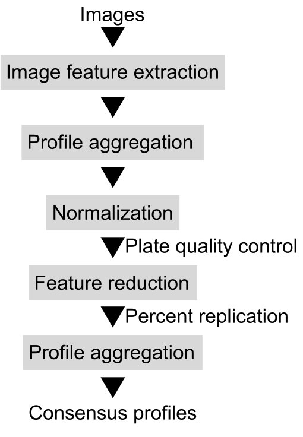
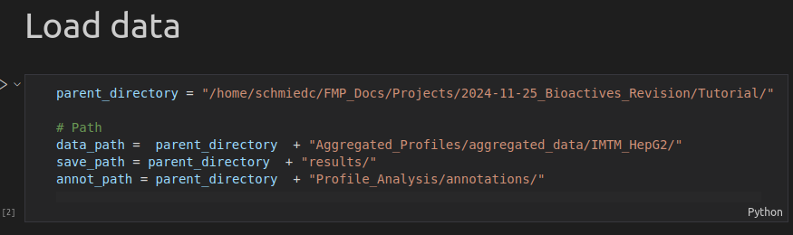

# Morphological Profiling Dataset of EU-OPENSCREEN Bioactive Compounds Over Multiple Imaging Sites and Cell Lines

Code authors: Carsten Beese and Christopher Schmied

Please cite:

Christopher Wolff, Martin Neuenschwander, Carsten Joern Beese, Divya Sitani, Maria C. Ramos, Alzbeta Srovnalova, Maria Jose Varela, Pavel Polishchuk, Katholiki E. Skopelitou, Ctibor Skuta, Bahne Stechmann, Jose Brea, Mads Hartvig Clausen, Petr Dzubak, Rosario Fernandez-Godino, Olga Genilloud, Marian Hajduch, Maria Isabel Loza, Martin Lehmann, Jens Peter von Kries, Han Sun, Christopher Schmied; Morphological Profiling Dataset of EU-OPENSCREEN Bioactive Compounds Over Multiple Imaging Sites and Cell Lines; bioRxiv 2024.08.27.609964; doi: https://doi.org/10.1101/2024.08.27.609964

# Resources:

Aggregated and processed profiles are hosted on a Zenodo repository: [https://doi.org/10.5281/zenodo.13309566](https://doi.org/10.5281/zenodo.13309566)

The raw image data is hosted on the AWS Cell Painting Gallery under cpg0036-EU-OS-bioactives: [https://cellpainting-gallery.s3.amazonaws.com/index.html#cpg0036-EU-OS-bioactives/](https://cellpainting-gallery.s3.amazonaws.com/index.html#cpg0036-EU-OS-bioactives/)

Information about the compounds: [https://www.probes-drugs.org/compounds/standardized#compoundset=353@AND](https://www.probes-drugs.org/compounds/standardized#compoundset=353@AND)

# Description:

Code shows how to load, process and analyse aggregated Cell Painting data. Each folder contains the analysis for a dataset from one of the four sources (FMP, IMTM, MEDINA, USC). The notebooks were used to create the figure panels of the associated publication.

# Notebooks:

* 1_Collect: Collects aggregated Cell Painting data into a single dataframe.
* 2_Normalization: Processing of profiles with normalization.
* 3_Feature-Selection: Feature selection, QC analysis and computation of consensus profiles.

# QC analysis:

* Number of toxic compounds.
* Number of low active compounds.
* Percent replication.

# Further analysis:

* Comparison between U2OS and HepG2 cell line from the FMP (FMP/4_Comparison_Cell_Lines.ipynb).
* UMAP for visualization of FMP U2OS and HepG2 datasets (UMAP_Viz.ipynb).
* Analysis of Batch effects using UMAPs (Batch_QCViz.ipynb).
* Overall cell numbers and cell numbers per control compound per dataset (CellNumber.ipynb).
* Characterization of Bioactive compounds (Characterize_Bioactive.ipynb).

# Tutorial data access and analysis:

## Setting up the analysis

For analysis please download this repository [https://docs.github.com/en/repositories/working-with-files/using-files/downloading-source-code-archives](https://docs.github.com/en/repositories/working-with-files/using-files/downloading-source-code-archives). Alternatively there is also a version of the code provided in the [Zenodo repository](https://doi.org/10.5281/zenodo.13309565).

The analysis is setup in jupyter notebooks. I work with [Visual Studio code](https://code.visualstudio.com/docs/datascience/jupyter-notebooks). But also Jupyter should work.

You will need to install the necessary dependencies via the `environment.yml` file included in this repository.

## Access & analysis of Profiles

The profiles are hosted on Zenodo: [https://doi.org/10.5281/zenodo.13309565](https://doi.org/10.5281/zenodo.13309565). For the performed analysis please have a look at our article [https://doi.org/10.1101/2024.08.27.609964](https://doi.org/10.1101/2024.08.27.609964). In brief we extracted the profiles using a Cell Profiler based pipeline. This yields single cell profiles that were then aggregated using a median per well. The below Figure shows a diagram of the analysis workflow.



### Load raw data

You can get access to the per well aggregated profiles: [Aggregated_Profiles.zip](https://zenodo.org/records/13309566/files/Aggregated_Profiles.zip?download=1). Unzip the folder. Contained there are all the profiles separated by source and cell line:

```
Aggregated_Profiles
└── aggregated_data
    ├── FMP_HepG2
    ├── FMP_U2OS
    ├── IMTM_HepG2
    ├── MEDINA_HepG2
    └── USC_HepG2
```

In the respective folder you will then find .csv files for each plate. Here for instance with the FMP U2OS data:

```
IMTM_HepG2
├── 2023-07-20_HepG2_10uM_B1003_R3_CP_Profiles_Aggregated.csv
├── 2023-07-19_HepG2_10uM_B1004_R3_CP_Profiles_Aggregated.csv
├── ...
└── 2023-07-06_HepG2_10uM_B1001_R1_CP_Profiles_Aggregated.csv
```

The file name is then structured the same way

-`2023-07-20`: With the date when they have been imaged by the microscope e.g. NOTE: this does not necessarily corrspond to the batch date as the plates could have been imaged over night.

-`HepG2` cell line, in this case HepG2

-`10uM` concentration of tested compounds (i.e. 10 µM)

-`B1003` EU-OPENSCREEN Plate ID

-`R3` Which replicate

-`_Profiles_Aggregated.csv`fixed suffix

To work with this data you will also need the annotation files. These are included in the [Profile_Analysis.zip](https://zenodo.org/records/13309566/files/Profile_Analysis.zip?download=1):

```
Profile_Analysis
├── analysis_results
├── annotations
├── EU-OS_bioactives-1.0.0
├── figures
└── senescence_figure
```

The annotations are enclosed in the `annotations`folder. 

In this tutorial I will focus on the processing of the IMTM HepG2 dataset. In the repository navigate to the `Analysis_IMTM/`folder of the downloaded analysis repository.

Then select the notebook `1_Collect_IMTM_HepG2.ipynb` which will allow you to load the data from one site.

You will need to modify directories in this notebook to use it:



1. Specify a parent directory where to find all the inputs and where you want to save the outputs.
2. Give a path to the aggregated data you want to process (i.e. IMTM_HepG2).
3. Specify a directory where you want to save the results of the processing.
4. Give the path to the annotations directory.

This loads the aggregated data. Merges it with the annotations and saves the output in the specified results directory. 

```
results
├── 2024-11-27_IMTM_HepG2_raw.csv
└── 2024-11-27_IMTM_HepG2_raw_missing_wells.csv
```

The files are save with a date `2024-11-27`, the source `IMTM`, cell line `HepG2`and the processing stage as suffix `raw.csv`.

### Normalization

The results of the data loader can then be further processed. The first step is typically a normalization. You can perform this processsing using 


## Image data

The image data is hosted on the Amazon Web Services (AWS) Cell Painting gallery ([Weisbart et al. 2024](https://doi.org/10.1038/s41592-024-02399-z)): [AWS Cell Painting Gallery](https://github.com/broadinstitute/cellpainting-gallery)

The dataset name is: cpg0036-EU-OS-bioactives

The dataset can be viewed and navigated here: [https://cellpainting-gallery.s3.amazonaws.com/index.html#cpg0036-EU-OS-bioactives/](https://cellpainting-gallery.s3.amazonaws.com/index.html#cpg0036-EU-OS-bioactives/)

The download process from the Cell Painting Gallery is documented here: [https://broadinstitute.github.io/cellpainting-gallery/download_instructions.html](https://broadinstitute.github.io/cellpainting-gallery/download_instructions.html)

The image data can be downloaded using the Amazon Web Services Command Line Interface ([AWS CLI](https://docs.aws.amazon.com/cli/latest/userguide/cli-chap-welcome.html)). You will first need to install these tools: [https://docs.aw.amazon.com/cli/latest/userguide/getting-started-install.html](https://docs.aws.amazon.com/cli/latest/userguide/getting-started-install.html)

Listing the dataset:

```
aws s3 ls s3://cellpainting-gallery/cpg0036-EU-OS-bioactives/ --no-sign-request
```

Which should result in the following output:

```
PRE FMP/
PRE IMTM/
PRE MEDINA/
PRE USC/
```

### Download of entire dataset.

The entire image dataset is 3.5 TB in size.

Download the data will then be: `aws s3 cp --recursive "CPG_LOCATION" "LOCAL_DESTINATION"`

Thus would look like this:

```
aws s3 cp --recursive s3://cellpainting-gallery/cpg0036-EU-OS-bioactives/ PATH/TO/LOCAL/ --no-sign-request
```

If you just want to test the command before an actual download then use. IMPORTANT the . denotes the current directory:

```
aws s3 cp --recursive s3://cellpainting-gallery/cpg0036-EU-OS-bioactives/ . --no-sign-request --dryrun
```

For the actual download just remove the flag --dryrun.

### Download a subset of the data

Please review the data structure and navigate the data here: [https://cellpainting-gallery.s3.amazonaws.com/index.html#cpg0036-EU-OS-bioactives/](https://cellpainting-gallery.s3.amazonaws.com/index.html#cpg0036-EU-OS-bioactives/)

The image data is structured per image site (FMP, IMTM, MEDINA and USC) as well as batches (Plates that were acquired on the same time) and plates.

For instance the image data of a single plate can be accessed via such a path [https://cellpainting-gallery.s3.amazonaws.com/index.html#cpg0036-EU-OS-bioactives/FMP/images/2021_09_03_Batch1_HepG2/images/210809R1B1001__2021-09-03T15_15_17-Measurement/Images/](https://cellpainting-gallery.s3.amazonaws.com/index.html#cpg0036-EU-OS-bioactives/FMP/images/2021_09_03_Batch1_HepG2/images/210809R1B1001__2021-09-03T15_15_17-Measurement/Images/)

Were `FMP`is the imaging site that acquired the data.`2021_09_03_Batch_HepG2` denotes the identity of the batch. `210809R1B1001__2021-09-03T15_15_17-Measurement`is the folder that contains all the images of a single plate.

A single plate can be downloaded using this path:

```
aws s3 cp --recursive s3://cellpainting-gallery/cpg0036-EU-OS-bioactives/FMP/images/2021_09_03_Batch1_HepG2/images/210809R1B1001__2021-09-03T15_15_17-Measurement/ . --no-sign-request --dryrun
```

### Notes for image data download

Use the --dryrun flag before executing the download to test if the commands and as well as the source and destination locations are correct.

Please review the Cell Painting data structure guide to understand the structure of the data  provided: [https://broadinstitute.github.io/cellpainting-gallery/data_structure.html](https://broadinstitute.github.io/cellpainting-gallery/data_structure.html)

You do not need an AWS account for download of the files. If you get and error with the AWS CLI command add --no-sign-request to the end of the command.
